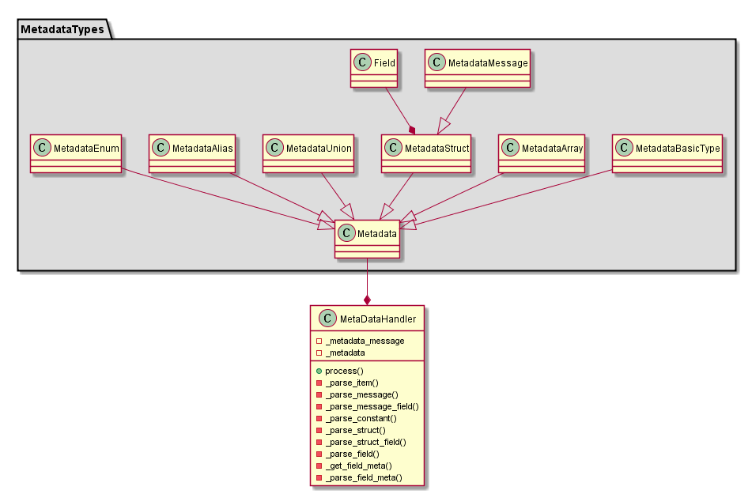

尝试使用plantUML画类图，在画出基本的联系图之后发现实在太乱，如下：


```
MetadataBasicType --|> Metadata
MetadataArray --|> Metadata
MetadataStruct --|> Metadata
MetadataMessage --|> Metadata
MetadataUnion --|> Metadata
MetadataAlias --|> Metadata
MetadataEnum --|> Metadata

MetadataBasicType --* MetaDataHandler
MetadataArray --* MetaDataHandler
MetadataStruct --* MetaDataHandler
MetadataMessage --* MetaDataHandler
MetadataUnion --* MetaDataHandler
MetadataAlias --* MetaDataHandler
MetadataEnum --* MetaDataHandler
```

之后考虑使用package将一些相关的类组织起来，继而再次想到自己的做法会导致抽象依赖于细节，
违反了`依赖倒置原则`，因此将其依赖关系进行调整：


```
package "MetadataTypes" #DDDDDD {

MetadataBasicType --|> Metadata
MetadataArray --|> Metadata
MetadataStruct --|> Metadata
MetadataMessage --|> Metadata
MetadataUnion --|> Metadata
MetadataAlias --|> Metadata
MetadataEnum --|> Metadata

}

Metadata --* MetaDataHandler
```

同时发现在plantUML里需要先定义关系，再定义对象。最终的类图为：


